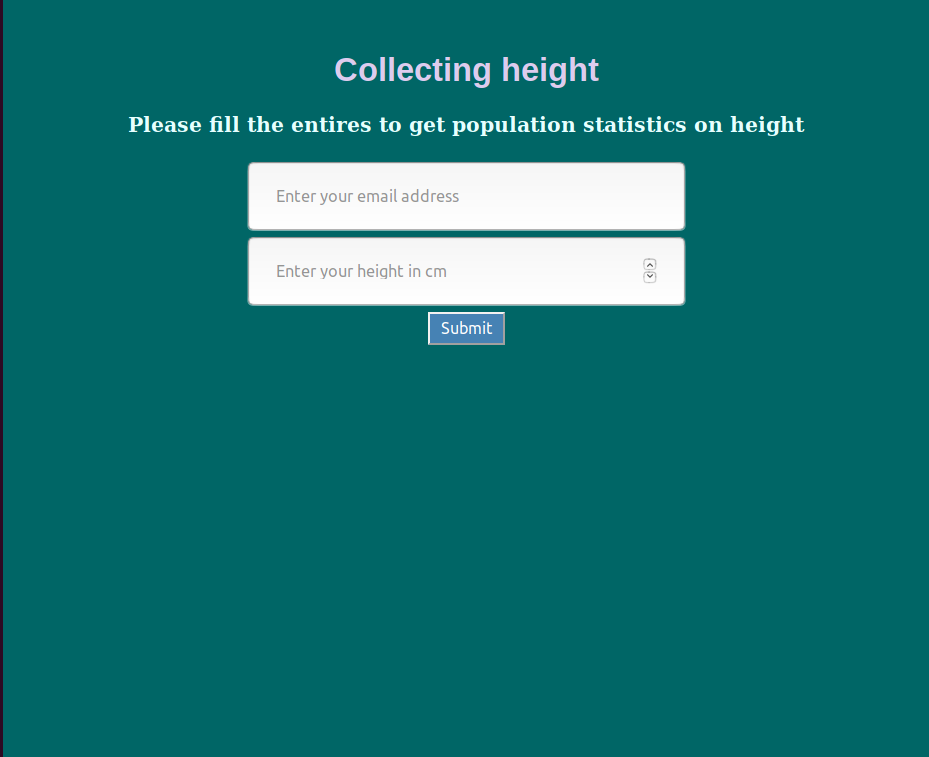

# DatabaseWebApp

The purspose of the app is a simple website developeed using Flask and SQLAlchemy which expects as input an e-mail address and a height for a specific user, it will store this information in a database and it will then send to the user the information received and the height average of all the people who took part in the experiment.

The files of the application are:
  1. app.py - the main application
  2. send_email.py - email sender
  3. templates/ - the html code
  4. static/ - the css code
 

A visual reprresentation of the project:

