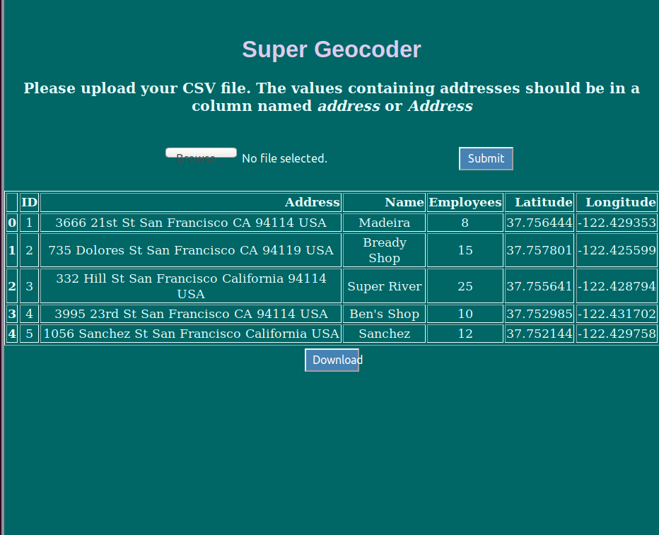

# GeocoderWeb

The purspose of the app is a simple website developeed using Flask which lets the user upload a csv file containing different information about locations, then it will be able to actual view the table on the website and later on download the file.

The files of the application are:
  1. app.py - the main application
  2. send_email.py - email sender
  3. templates/ - the html code
  4. static/ - the css code
  5. sample_files/ - example files to be uploaded
  6. instructions.txt - created by the instructor on Udemy
 

A visual reprresentation of the project:

